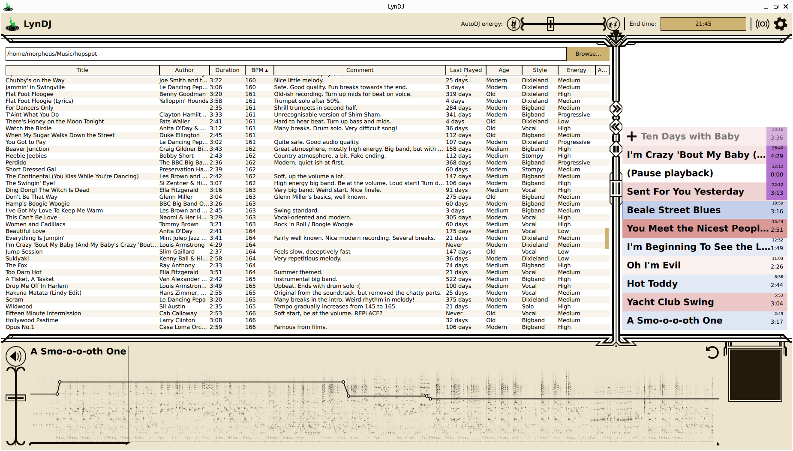

LynDJ
=====
LynDJ is a desktop application designed for playing music for an audience. In particular, it is specialised to playing music for Lindy Hop socials. This DJ software allows playback of music easily and safely, and provides extra control and information for what is important for swing dancing.



Main features
-------------
* A graphical interface with a thematic design.
* The interface is designed to prevent accidentally starting/stopping playback, for use with fiddly touch pads.
* Select music from your library, and create a playlist.
* Control volume for playback, and store these volume changes for future play-throughs of that track.
* Track metadata on tracks such as BPM, recording age, style, energy level and wen it was last played.
* Sort your library by any metadata.
* Set an end time for your session and get a warning when that time is approaching.
* A frequency spectrograph to visualise upcoming musical cues.
* Toggling between mono and stereo, for use with bad speaker set-ups.
* An Auto-DJ will suggest the next track to play.

Installation
------------
There are several ways to install this application onto your computer. This outlines your options, from easy to hard. Each option includes instructions for various platforms. If your platform is not listed, please select the most similar platform (e.g. for Arch Linux, installation is probably similar to Ubuntu). Note that the instructions are written for a clean installation of the operating system. You might already have some of the prerequisites installed.

<details>
<summary>From source: Ubuntu 22.04</summary>

1. Install system dependencies. To do this, open a terminal (Ctrl+Alt+T) and type the following:
```
sudo apt install python3-pip git portaudio19-dev
```
2. Download the source code of LynDJ.
```
git clone https://github.com/Ghostkeeper/LynDJ
cd LynDJ
```
3. Install LynDJ's Python dependencies.
```
python3 -m pip install -r requirements.txt
```
4. You can now run the application from the terminal inside of this directory, by executing:
```
python3 lyndj.py
```
</details>
<details>
<summary>From source: Windows 10</summary>

1. Install Python. Visit [python.org](https://www.python.org/) and download the latest version of Python for Windows, using the installer. Run the installer to install Python. It is suggested to check the option "Add python.exe to PATH".
2. Install Visual Studio Build Tools. Visit [its download page](https://visualstudio.microsoft.com/visual-cpp-build-tools/) and download the build tools. Run the installer. Select the "Desktop development with C++" package. Once installation is completed, you can close the installer.
3. Install Git. Visit [git-scm.com](https://git-scm.com/download/win) and download the latest version of Git for Windows. Run the installer to install Git. At the last screen of the installer, check that you wish to launch the Git terminal.
4. Open a Git terminal. Navigate to a directory where you want to download LynDJ to, and download LynDJ, by typing the following:
```
git clone https://github.com/Ghostkeeper/LynDJ
```
5. Open a normal terminal as well (press Windows key, then type cmd). Navigate to the LynDJ folder that was just created by Git. Install LynDJ's dependencies by executing:
```
python -m pip install -r requirements.txt
```
6. You can now run the application from the terminal inside of this folder, by executing:
```
python lyndj.py
```
</details>

Usage
-----
For usage instructions, please refer to [the documentation](doc/usage.md).

Build
-----
These are instructions to create a release build of this software.

<details>
<summary>Ubuntu 22.04</summary>

1. Install Git in order to download the source code. To do this, open a terminal (Ctrl+Alt+T) and type the following:
```
sudo apt install git
```
2. Download the source code of LynDJ.
```
git clone https://github.com/Ghostkeeper/LynDJ
cd LynDJ
```
3. Run the script that generates an AppImage:
```
packaging/ubuntu.sh
```
4. Test the application by running the AppImage that was generated.
```
chmod +x LynDJ.AppImage
./LynDJ.AppImage
```
</details>
<details>
<summary>Windows 10</summary>

1. Install Python. Visit [python.org](https://www.python.org/) and download the latest version of Python for Windows, using the installer. Run the installer to install Python. It is suggested to check the option "Add python.exe to PATH".
2. Install Visual Studio Build Tools. Visit [its download page](https://visualstudio.microsoft.com/visual-cpp-build-tools/) and download the build tools. Run the installer. Select the "Desktop development with C++" package. Once installation is completed, you can close the installer.
3. Install Git. Visit [git-scm.com](https://git-scm.com/download/win) and download the latest version of Git for Windows. Run the installer to install Git. At the last screen of the installer, check that you wish to launch the Git terminal.
4. Open a Git terminal. Navigate to a directory where you want to download LynDJ to, and download LynDJ, by typing the following:
```
git clone https://github.com/Ghostkeeper/LynDJ
```
5. Install the NSIS installer software. Visit [sourceforge.io](https://nsis.sourceforge.io/Download) and download the latest version of NSIS, using the installer. Run the installer to install NSIS.
6. Open a normal terminal (press Windows key, then type cmd). Navigate to the LynDJ folder that was created by Git. Then run the script that generates an installer:
```
packaging/windows.bat
```
7. You should now have an installer called `LynDJ-installer.exe`. Test it by installing LynDJ and running the application it installs.
</details>
