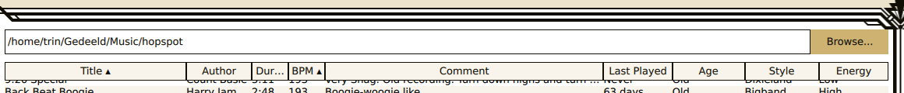
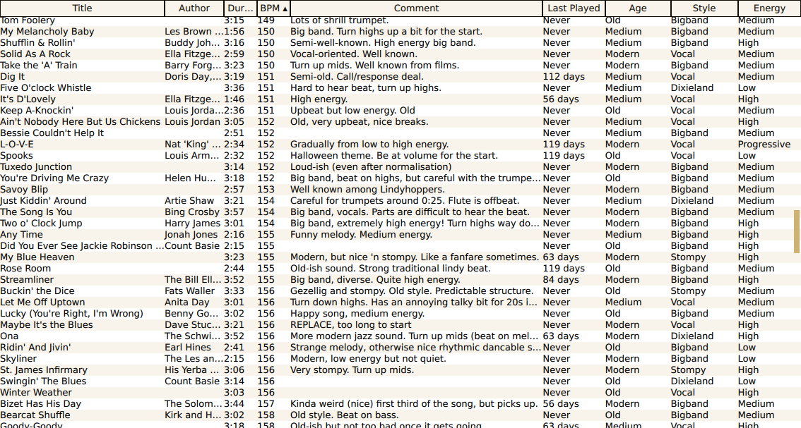
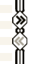
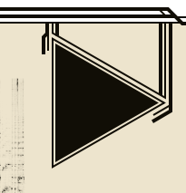
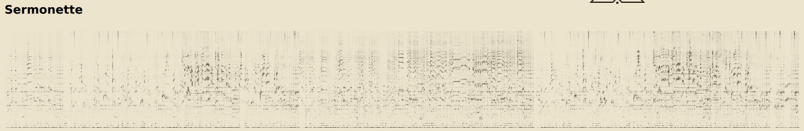
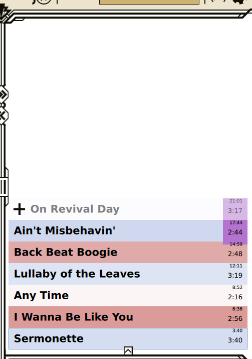
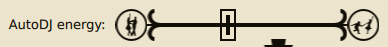
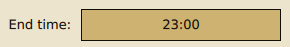
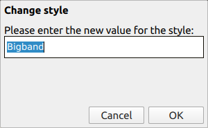
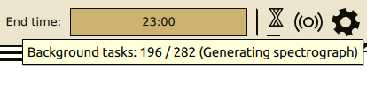

Usage instructions
==================
LynDJ is an application designed to select music for playback for swing dancers, and it is specifically designed to prevent the user accidentally interrupting the music. As such it can be a bit difficult to use. Things work differently from ordinary music players. This documentation will explain how to use the software.

Finding music
-------------
To find the music that you want to play, click the "Browse..." button in the main interface. A file dialogue will appear where you can select the directory that your music is stored in.

Alternatively, you can also type the path to this directory in the text field to the left of the browse button.

*LynDJ only plays music files stored on your computer. It does not stream music from the internet or access network drives.*

*Music is always found by selecting a directory. Opening a music file directly with LynDJ by double clicking on it will not cause that track to be played. The file browser only selects directories, not individual files.*

Once you've selected a directory, the music tracks will be listed below in a big table. It may take a few seconds to load all the metadata if there are a lot of files in this directory.

It is suggested to store all available music in one directory for quick access. That way you won't need to change the directory to select files from all the time, and you can make optimal use of the sorting capabilities and the AutoDJ feature.

Selecting tracks to play
------------------------
You will then want to select tracks to play for your audience. To do so, scroll through the table with all the music in your directory.

This table contains the following metadata:
* The title of the track, as stored in the file's metadata.
* The musician or group that made the track, the author, as stored in the file's metadata.
* The duration, how long the track would ordinarily take to play.
* The tempo of the track, in BPM (beats per minute). This is initially empty but can be filled in manually.
* A comment for the track, as stored in the file's metadata.
* When the track was last played using this application, initially "never".
* The recording age of the track, to be filled in manually.
* The style of the track, to be filled in manually.
* The energy level of the track, to be filled in manually.

For more information about some of these metadata fields, please refer to the section about metadata.

The table can be sorted by clicking on a column. Clicking on the same column again will sort it in the opposite order. The columns can also be resized by dragging the lines between them in the column headers.

When you've found a track you would like to play, double click it to add it to the queue, or select it and press the `>>` button to move it to the queue. This will place the track at the top of the queue, causing it to play after all other tracks currently in the queue.

Playing music
-------------
With a few tracks queued up, it is time to start the music. To do so, simply press the big triangular play button in the bottom-right corner of the window.

This will start the music playing. Each track in the queue will play in turn. The progress of the playback will be shown with a horizontal line across the bottom of the window, and a vertical line going up at its end.

*The music will automatically be trimmed to remove silence at the start and end of the track. This can cause the duration of the track to be slightly inaccurate when it is actually played.*

The volume of the music can be controlled using the slider on the left side. The volume starts at 50%, in order to allow for volume increases as well as decreases without compromising fidelity or adding crackling to the audio. If you adjust the volume, note that a line gets drawn across the track with two nodes for where the volume was adjusted. The adjustment to the volume will be remembered and be repeated the next time that this track plays! This allows you to amplify soft parts of the track (in order to allow your dancers to follow the beat) or mute loud parts (to prevent hurting their ears).

Across the bottom of the screen is a spectrograph of the track. This shows a frequency spectrum of each part of the track. High frequency sounds are shown at the top, and low frequency sounds at the bottom. The spectrograph can be used to predict where in the track certain changes to the music will occur. You can see a break in the music coming because it will be shown as a lighter-coloured gap in the spectrograph. You can sometimes recognise different instruments coming up, like trumpets and drums being prominent in the high frequencies, or a saxophone having the melody fairly clearly drawn out in the middle of the spectrum. Use this information to pre-emptively adjust volumes or an equaliser, or to play with the audience if they are paying attention to you.

Finally, there is also the option to play audio in mono only. This can be useful if you regularly play in different places or the speaker system where you're playing is not well set up. To toggle between mono and stereo, press the button in the top bar that looks like a circle with waves coming out from one or two of its sides.

The playlist
------------
On the right side of the screen is a playlist. Tracks listed at the bottom of the playlist (closest to the play button) will be next up for playing. If a track is playing, the bottommost track is the one currently being played.

The playlist shows some information about each track:
* The title of the track, in big letters on the left.
* The comment for the track is shown when hovering over the track.
* The duration of the track, on the right.
* Above the duration, the time until the track finishes playing. For tracks higher up in the queue, the cumulative durations of the previous tracks is added, so that you can see when a certain track will be playing.
* The tempo of the track is indicated by the colour. A red track has a high tempo, while a blue track has a low tempo.
* If the track exceeds the session end time, a purple colour will appear on the right, to indicate from where on the session end time will be exceeded.

For more information about a track, you can also select it in the playlist. The track will then also be selected in the music directory on the left, where you can see the rest of the metadata (like when it was last played).

You can re-order tracks in the queue by dragging them. You can remove them from the playlist as well by pressing the `<<` button to the left of the queue, moving them back to the track directory as it were. If a track is currently playing, that track cannot be re-ordered or removed from the queue. Tracks can also not be moved to be played after any AutoDJ-suggested track.

The AutoDJ
----------
LynDJ also suggests tracks to be played next. In fact, from the moment that you've selected a directory with music it may have already put a track in the playlist for you.

The AutoDJ will select from tracks in the table on the left. It will suggest a track to be added to the queue based on the following factors:
* The tempo of the track, in order to get a varied tempo cadence.
* The recording age of the track, to get a varied set.
* The style of the track, to get a varied set.
* The energy level of the track, to get a varied set.
* When the track was last played, favouring tracks not recently played.
* Tracks that were already played this set will not be suggested again.

The suggestion from the AutoDJ will be shown at the top of the playlist, faded out slightly and with a `+` symbol in front. Pressing the `+` will cause the track to be added normally to the queue.

If the queue is empty, the suggested track by the AutoDJ will automatically be added to the queue and played. That way, there is always something in the queue and the music will always continue, even if you are not present or not paying attention.

The AutoDJ can be controlled to some extent with a slider at the top, to control the energy level for the suggested tracks. Move the slider to the right to suggest more high-energy tracks or to the left to suggest more low-energy tracks. For instance, you could let it suggest more low-energy tracks towards the end of the evening when everyone is tired.

For optimal suggestions by the AutoDJ, it helps to give it appropriate information by filling in the metadata of your tracks. In particular the "Energy" field is of note since it watches for certain keywords. The AutoDJ understands the following energy levels:
* High
* Medium
* Low

Anything else is interpreted as "medium" energy.

*If you don't wish to get suggestions for which track to add next, the AutoDJ can also be disabled in the preferences screen.*

The end of the session
----------------------
You can configure when the DJ session needs to end by setting an end time at the top of the window.

This has no real effect on your set. You can keep playing if you wish. However it will warn you that you are exceeding the set end time by colouring the duration purple in the playlist.

Maintaining your library
------------------------
The track information in your library is remembered partly in the music file itself and partly by LynDJ separately. Music files have fields for the following metadata information, so that they can be stored in the file itself:
* Title
* Author
* BPM
* Comment

Transferring files from one computer to another will preserve those metadata fields, but not others (other than Duration which cannot be changed).

To change metadata of a file, simply right-click on a cell in the table. This will bring up a small dialogue where the new value for the metadata can be entered.

*The duration and last played fields cannot be adjusted.*

The values you fill in for age, style and energy are entirely up to you to categorise as you wish. You can make up your own categories to categorise the tracks by style, for instance. However for the AutoDJ it is best to be consistent. The AutoDJ will generally attempt to create varied sets, and will suggest a track with an age, style and energy level that hasn't recently been played. As such, having spelling mistakes in these categories will reduce the effectiveness of the AutoDJ due to it thinking the tracks e.g. have different styles even if the difference is just a typo. The energy level of the track is also interpreted with specific values for High and Low.

Background tasks
----------------
LynDJ might need to process things in the background in order to optimise performance. Some tasks it does require a lot of processing power and time to execute, since it works on the audio data which is quickly multiple gigabytes of decoded data.

To show that background processing is going on, an hourglass symbol is shown in the top right. Hovering over this icon will show what it is working on in the background. A small progress bar beneath it indicates how far it has progressed in completing all background tasks.

Further options
---------------
There is a preferences screen that allows you to tweak detailed behaviour of the software. To access this, click on the gear icon in the top-right corner of the application.

The preferences screen allows changing various parts of the interface (e.g. what is considered a slow or fast tempo), aspects of music playback (e.g. the pause between tracks) or the AutoDJ behaviour (e.g. how much each factor weighs in on the decision).